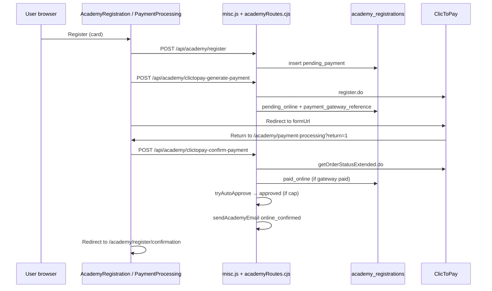

# Academy payment healthcheck — 2026-06-27

## Executive summary

| Verdict | **CONDITIONAL PASS (code)** — confirm validation hardened; **live payment test still required** |
|--------|----------------------------------------------------------------------------------------------------------------------------------|
| Serverless entrypoint | All Academy routes run through `api/misc.js` (Express via `academyRoutes.cjs`) |
| Gateway | Same ClicToPay client as events (`registerClicToPayPayment`, `fetchClicToPayOrderStatus`) |
| Card flow | Separate tables, statuses, emails — **not** ticket `orders` / `paid-order-fulfillment` |
| Live payment test | **Not run** (requires owner-approved controlled production or sandbox payment) |

Academy card payments are **architecturally separate** from event ticket fulfillment. Recent event fixes (dedicated `clictopay-confirm-payment.js`, ticket QR/PDF, entrypoint bare imports) **do not automatically apply** to Academy except where Academy shares `misc.js` (SMTP via `nodemailer`).

---

## 1. Academy payment flow summary



### Status lifecycle (card)

| Status | Meaning |
|--------|---------|
| `pending_payment` | Registered, not yet at gateway |
| `pending_online` | Gateway session created (`payment_gateway_reference` set) |
| `paid_online` | Gateway reports paid (orderStatus 2) |
| `approved` | Place confirmed (auto or admin); cap-limited |
| `failed` | Gateway did not confirm on callback |
| `cancelled` | Auto-expired (~17 min) without payment |
| `proof_received` | Manual RIB/D17 only |

**Enrollment/access** = `approved` status on `academy_registrations` (no separate enrollments table).

---

## 2. API routes involved

### Public (card payment)

| Method | Route | Handler |
|--------|-------|---------|
| GET | `/api/academy/status` | Page open / sold-out |
| POST | `/api/academy/validate-promo` | Promo validation |
| POST | `/api/academy/register` | Create registration |
| GET | `/api/academy/registration/:id/status` | Poll status (read-only) |
| POST | `/api/academy/clictopay-generate-payment` | Start ClicToPay |
| POST | `/api/academy/clictopay-confirm-payment` | Verify + fulfill |

Vercel rewrites: all above → `api/misc.js`.

### Admin

| Method | Route | Purpose |
|--------|-------|---------|
| GET/PATCH | `/api/admin/academy/settings` | Cap, fees, messages |
| GET | `/api/admin/academy/registrations` | List |
| GET | `/api/admin/academy/registrations/:id` | Detail + proof URL |
| PATCH | `/api/admin/academy/registrations/:id` | Email correction only |
| POST | `/api/admin/academy/registrations/:id/approve` | Manual approve |
| POST | `/api/admin/academy/registrations/:id/reject` | Reject |
| POST | `/api/admin/academy/registrations/:id/resend-email` | Resend **approved** template only |
| GET | `/api/admin/academy/reports` | Stats |

### Cron

| Method | Route | Purpose |
|--------|-------|---------|
| GET/POST | `/api/auto-cancel-expired-academy-registrations` | Cancel stale card pendings (`requireCronSecret`) |

### Frontend pages

| Path | Role |
|------|------|
| `/academy/register` | Form + payment method |
| `/academy/payment-processing` | `init=1` → generate; `return=1` → confirm |
| `/academy/register/confirmation` | Success UI |

---

## 3. Database tables involved

| Table | Role |
|-------|------|
| `academy_registrations` | Primary order/payment/enrollment record |
| `academy_registration_logs` | Audit trail (`payment_confirmed`, `auto_approved`, etc.) |
| `academy_settings` | Cap (`max_approved_total`), fees, page flags |
| `academy_promo_codes` | Discounts |
| `storage.academy-payment-proofs` | RIB/D17 proofs (private) |

Key `academy_registrations` payment fields:

- `total_amount_dt`, `fee_amount_dt`, `base_amount_dt`, `discount_amount_dt`
- `payment_method` (`card` | `rib` | `d17`)
- `payment_gateway_reference` (ClicToPay order id)
- `payment_confirm_response` (sanitized JSONB)
- `status`, `email_sent_at`, `last_email_type`

**RLS:** enabled on all Academy tables with **no anon/authenticated policies** — API-only via service role.

---

## 4. Payment verification logic

### Generate (`clictopay-generate-payment`)

- Loads registration; requires `payment_method === 'card'`.
- Rejects expired/cancelled, sold out, already paid.
- **`registrationAmountsAreValid(reg, feeRate)`** — server-side anti-tamper on stored amounts before charging.
- `registerClicToPayPayment({ amount: total_amount_dt, orderNumber: registration_number sans dashes })`.
- Stores `payment_gateway_reference`, sets `pending_online`.

### Confirm (`clictopay-confirm-payment`)

- Requires `payment_gateway_reference`.
- **`fetchClicToPayOrderStatus(ctpId)`** — success when `orderStatus === '2'` and `errorCode === 0`.
- **Does not call `validateClicToPayPaymentForOrder`** (event-hardened helper).

### Gap vs event flow

Event confirm uses `validateClicToPayPaymentForOrder` which checks:

- Gateway paid state
- **Order reference match** (`orderNumber` vs `order_number`)
- **Currency** (`TND` / `788` / etc.)
- **Amount** (millimes, ±1 tolerance)

Academy confirm **only** checks `gateway.ok`. It does **not** verify:

- Gateway `amount` vs `total_amount_dt * 1000`
- Gateway `currency`
- Gateway `orderNumber` vs `registration_number`

**Risk:** A misconfigured or exploited gateway response with status 2 but wrong amount could mark a registration `paid_online` without matching the charged amount. Generate-time validation does not protect confirm-time mismatch.

---

## 5. Fulfillment / enrollment logic

After gateway OK:

1. Conditional update `pending_payment|pending_online` → `paid_online` (idempotent row lock).
2. `logAcademyEvent('payment_confirmed')`.
3. `tryAutoApprove` — if under `max_approved_total`, `paid_online` → `approved` (skips duplicate approved email).
4. `sendAcademyEmail(..., 'online_confirmed')` — always attempted after first paid transition.
5. `runAcademyPurchaseTracking` — Meta CAPI (non-blocking).

If cap reached: stays `paid_online`, user still gets **online_confirmed** email (payment received, place pending cap).

**No tickets, QR, or PDF** — Academy emails are HTML-only (`academy-email-html.cjs`).

---

## 6. Email / receipt logic

| Template | When |
|----------|------|
| `online_confirmed` | Card payment confirmed |
| `manual_received` | RIB/D17 proof uploaded |
| `approved` | Admin or auto approve (place confirmed) |

Transport: `sendTransactionalEmail` + `getEmailTransporter` → **nodemailer** (Brevo SMTP when configured).

- No `qrcode`, `pdf-lib`, or `@sparticuz/chromium` on Academy path.
- **Vercel bundling:** Academy routes use `misc.js`, which has entrypoint bare imports including `nodemailer` — **SMTP should bundle correctly** after commit `b0d1123`.
- Email failure: `sendAcademyEmail` catches, logs `e.message`, returns `false`; **payment state is not rolled back** (`paid_online` / `approved` kept).
- `email_sent_at` / `last_email_type` updated only when send returns true.

---

## 7. Idempotency result

| Scenario | Behavior | Assessment |
|----------|----------|------------|
| Duplicate confirm (already `approved`) | `alreadyPaid: true`, meta tracking only | OK |
| Duplicate confirm (`paid_online`) | Re-runs `tryAutoApprove`, no second `online_confirmed` | OK (no email spam) |
| Duplicate confirm (concurrent from `pending_online`) | One wins update; loser may get `410 registration_expired` | **Fragile UX** — client uses `confirmStartedRef` mitigates single tab |
| Double charge | Single gateway session per `payment_gateway_reference` | OK (gateway-side) |
| Duplicate registration | Unique index on `(email, formule)` for active statuses | OK |
| Duplicate approve | `tryAutoApprove` / admin update from allowed statuses only | OK |

---

## 8. Security result

| Check | Result |
|-------|--------|
| Frontend cannot set `paid_online` / `approved` | **PASS** — only confirm + admin/cron server paths |
| Gateway verification required for card paid | **PASS** (status 2) |
| Amount/currency at confirm | **FAIL** — not validated |
| Service role in browser | **PASS** — server-only `getServiceDb()` |
| RLS on Academy tables | **PASS** — deny direct client access |
| Admin routes | **PASS** — `requireAdminAuth` + `academy:manage` |
| Cron cancel | **PASS** — `requireCronSecret` |
| Registration status GET | **PASS** — read-only, no status mutation |
| Admin PATCH registration | **PASS** — email field only, not status |
| Rate limit on register | **PASS** — IP limiter (5/hour) + reCAPTCHA when configured |
| Payment proof storage | **PASS** — private bucket, service role upload |

---

## 9. Vercel bundling / dependency result

| Dependency | Academy needs? | Bundled via |
|------------|----------------|-------------|
| `nodemailer` | Yes (SMTP emails) | `misc.js` bare `import 'nodemailer'` |
| `qrcode` / PDF / Chromium | No | N/A for Academy |
| `academyRoutes.cjs` | Yes | `vercel.json` `includeFiles` + `requireFromRoot('../academyRoutes.cjs')` |
| `multer` / `bcryptjs` | Yes (register, influencers) | `misc.js` static requires |

**Assessment:** Academy card email path should work with current `misc.js` entrypoint tracing. Academy does **not** depend on `clictopay-confirm-payment.js` or ticket fulfillment `_lib` bundle.

---

## 10. Tests run

```bash
npm run test:payment-fulfillment  # 56/56 pass (event/ticket focused)
npm run build                     # pass
```

### Academy-specific tests (existing)

- `api/_lib/academy-influencer-hardening.test.cjs`
- `api/_lib/academy-meta-db.test.cjs`
- `api/_lib/meta/academy-purchase-*.test.cjs`
- `src/lib/academy/academyPricing.sync.test.ts`

### Academy payment tests **missing**

- Confirm amount/currency mismatch rejection
- Confirm duplicate callback idempotency
- `registrationAmountsAreValid` on generate (logic exists, no route test)
- Email failure non-blocking integration test
- Recovery/resend for `paid_online` + missing email

---

## 11. Live / staging payment validation

**Not executed** in this review.

Required before accepting real Academy card volume:

1. One low-value card registration on production (owner approval) **or** ClicToPay test mode.
2. Confirm: no 500 on generate/confirm, `paid_online` → `approved` (if cap allows), `online_confirmed` email received.
3. Admin dashboard shows correct status.
4. Repeat confirm call → no duplicate enrollment, no duplicate email.
5. Vercel logs: no `MODULE_NOT_FOUND` for `nodemailer`.

---

## 12. Bugs / gaps found

### High

1. **No amount/currency/order-ref validation on Academy confirm** — unlike events (`validateClicToPayPaymentForOrder`). Confirm trusts `orderStatus === 2` only.

### Medium

2. **Admin resend limited to `approved`** — no admin resend for `online_confirmed` when stuck at `paid_online` with failed email.
3. **No Academy recovery script** — unlike `scripts/recover-paid-order-fulfillment.mjs` for events.
4. **Concurrent confirm loser returns `410 registration_expired`** — misleading when payment actually succeeded on winner path.
5. **Gateway timeout → `failed` status** — if customer was charged but status fetch timed out, registration marked failed (manual recovery needed).

### Low

6. **Email errors log `e.message` only** — not structured `{ message, code, details }` like `safeInsertEmailDeliveryLog`.
7. **Confirm does not sanitize/log structured payment context** on failure (only generic `console.error`).

---

## 13. Required fixes (recommended before “production-ready”)

1. **Add `validateClicToPayPaymentForAcademyRegistration(reg, statusData)`** in `api/_lib/clictopay-payment-verify.cjs` (or sibling):
   - Expected millimes: `Math.round(Number(reg.total_amount_dt) * 1000)`
   - Order ref: `registration_number` (normalized) vs gateway `orderNumber`
   - Currency check (reuse `ALLOWED_CURRENCIES`)
   - Call from `academyRoutes.cjs` confirm **before** `paid_online` update; on mismatch log structured error and return 400 without marking paid.

2. **Admin resend for `paid_online`** — allow `online_confirmed` template resend when `last_email_type` is null or admin requests.

3. **Academy recovery helper** (optional script): idempotent resend email / retry `tryAutoApprove` for `paid_online` without re-charging.

4. **Tests** for confirm validation + idempotent duplicate confirm.

5. **One controlled live payment** per safe testing plan.

---

## 14. Recovery plan (current state)

### Paid online, no email

- **Manual:** Admin cannot resend `online_confirmed` via UI today (resend requires `approved`).
- **Workaround:** Admin approve (if cap allows) triggers `approved` email, or fix resend endpoint.
- **Do not** re-run payment or create duplicate registration.

### Paid online, not approved (cap reached)

- Wait for cap increase or admin approve when slot opens.
- Status remains `paid_online`; user should have received `online_confirmed`.

### Zero gateway reference / stuck pending

- User can resume via duplicate register (same email+formule) → `resumed: true` → payment-processing.
- Cron cancels after ~17 minutes if never paid.

### Event recovery commands **do not apply**

```bash
# NOT for Academy — event orders only
node scripts/recover-paid-order-fulfillment.mjs --order-number ...
```

---

## Acceptance criteria scorecard

| # | Criterion | Status |
|---|-----------|--------|
| 1 | Server-side gateway verification | PASS |
| 2 | Amount/currency validated | **FAIL** (generate only) |
| 3 | PAID only after verification | PASS (`paid_online`) |
| 4 | Enrollment once | PASS |
| 5 | Duplicate callbacks safe | MOSTLY PASS |
| 6 | Confirmation email | PASS (if SMTP OK) |
| 7 | Email failure non-corrupting | PASS |
| 8 | Recovery for paid-unfulfilled | **PARTIAL** |
| 9 | No frontend fake success | PASS |
| 10 | No secrets exposed | PASS |
| 11 | Build/tests pass | PASS |
| 12 | One controlled payment E2E | **NOT RUN** |

---

## Files inspected

- `academyRoutes.cjs`
- `api/misc.js`
- `api/_lib/clictopay-client.cjs`
- `api/_lib/clictopay-payment-verify.cjs`
- `api/_lib/academy-db.cjs`, `academy-pricing.cjs`, `academy-email-html.cjs`, `academy-expire-pending.cjs`
- `src/pages/AcademyPaymentProcessing.tsx`, `useAcademyRegistration.ts`
- `src/lib/api-routes.ts`
- `vercel.json` (rewrites + `misc.js` includeFiles)
- `supabase/migrations/20260525120000_academy_registration_system.sql` (+ meta/influencer migrations)

---

*Generated: 2026-06-27 — investigation only; no production code changes applied.*

---

## Remediation applied (2026-06-27)

### Files changed

| File | Change |
|------|--------|
| `api/_lib/clictopay-payment-verify.cjs` | `validateClicToPayPaymentForAcademyRegistration`, audit builder, ref/amount helpers |
| `api/_lib/academy-payment-helpers.cjs` | Idempotency, admin resend template, confirm race interpretation |
| `api/_lib/academy-payment-fulfillment.cjs` | Recovery helper + structured email errors |
| `academyRoutes.cjs` | Hardened confirm, admin resend, structured email logs |
| `api/_lib/academy-payment.test.cjs` | Academy payment validation + idempotency tests |
| `scripts/recover-academy-registration-fulfillment.mjs` | CLI recovery (no re-charge) |
| `package.json` | `test:academy-payment` script |

### Validation helper

`validateClicToPayPaymentForAcademyRegistration(registration, statusData)` checks:

- Gateway paid (`orderStatus === 2`, `errorCode === 0`, no decline message)
- Order ref: `registration_number` normalized (no dashes, uppercase, max 32) vs gateway `orderNumber`
- Amount: `Math.round(total_amount_dt * 1000)` vs gateway millimes (±1)
- Currency: `TND` / `788` / allowed set

On failure: structured `buildAcademyPaymentValidationAudit` log; HTTP 400 `{ ok: false, error: 'payment_validation_failed' }` (or gateway-not-paid variant). **Does not** set `paid_online` on validation failure (except `gateway_not_paid` → `failed`).

### Confirm route behavior

- Idempotent paths for `paid_online` / `approved` via `respondAcademyConfirmIdempotent` (no duplicate `online_confirmed` email).
- `online_confirmed` email only when `shouldSendOnlineConfirmedEmail(previousStatus)` (first transition from pending).
- Concurrent update loser reloads row; if already `paid_online`/`approved` → idempotent success (not `410 registration_expired`).

### Admin resend / recovery

- Admin `POST /api/admin/academy/registrations/:id/resend-email` supports:
  - `approved` → `approved` template
  - `paid_online` + card + gateway ref → `online_confirmed` template
- Recovery script:

```bash
node scripts/recover-academy-registration-fulfillment.mjs --registration-id <uuid>
node scripts/recover-academy-registration-fulfillment.mjs --registration-number ACA-2026-00042
```

### Tests added / run

```bash
npm run test:academy-payment    # includes new academy-payment.test.cjs (15 new cases) + existing Academy suites
npm run test:payment-fulfillment  # 56/56 pass (event flow unchanged)
npm run build                   # pass
```

### Live / staging payment

**Not run yet.** Required before accepting Academy card volume.

### Remaining risks

| Risk | Notes |
|------|-------|
| Gateway timeout after charge | May leave `pending_online`; manual recovery script |
| Cap reached | Stays `paid_online` until slot opens; `online_confirmed` still sent |
| No E2E route integration test | Unit tests cover validation/idempotency; live payment still required |

### Final recommendation

**CONDITIONAL PASS (code)** — payment integrity blockers addressed in code and tests.

**Production PASS** only after **one controlled Academy card payment** validates end-to-end (see safe live validation in task).

