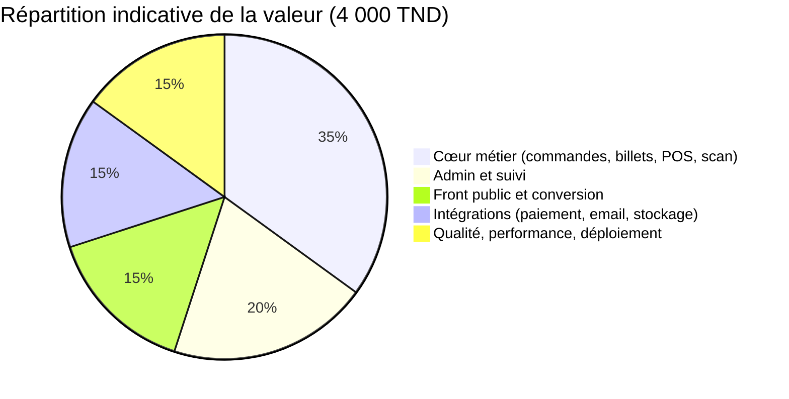
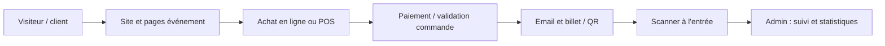

# Valorisation de la plateforme Andiamo Events — 4 000 TND

**Objet :** document de synthèse pour expliquer pourquoi la plateforme peut être valorisée à **4 000 dinars tunisiens** (prime de livraison, forfait de prestation, ou première facture — à préciser avec l’employeur).

**Contexte :** profil **full stack** (front-end, back-end, sécurité, intégrations, déploiement).

**Période :** travail sur la plateforme **à compter du 1er juin 2025**.

**Principe :** la valeur ne se mesure pas seulement au nombre de pages, mais aux **fonctionnalités métier**, aux **technologies intégrées**, aux **intégrations** et à la **fiabilité** en production.

**Version détaillée (stack, intégrations ClicToPay / Brevo / analytics, animations, PDF) :** ouvrir [`valorisation-plateforme-4000-tnd.html`](./valorisation-plateforme-4000-tnd.html) dans un navigateur.

---

## 1. Synthèse exécutive

| Élément | Détail |
|--------|--------|
| **Montant cible** | **4 000 TND** |
| **Nature de la valeur** | Application web **full stack** : site événementiel, vente et commandes, **réseau d’ambassadeurs**, **module carrières / RH** (offres, champs personnalisés, candidatures), **dashboard admin / super admin** (tous les onglets), POS, scan, emails, billets, médias |
| **Pourquoi ce montant est défendable** | **Forfait de livraison** d’un produit complet couvrant **toute la chaîne** technique |
| **Ce que l’entreprise obtient** | Un **système opérationnel** qui centralise ventes, validation d’entrées, suivi administratif et communication client |
| **Début du travail** | **1er juin 2025** |

---

## 2. Périmètre fonctionnel de la plateforme

| Domaine | Fonctions (référence technique : structure du dépôt) | Valeur pour l’entreprise |
|--------|------------------------------------------------------|---------------------------|
| **Site et contenu** | Pages événements, galerie / médias, vitrine | Image professionnelle, conversion visiteurs → acheteurs |
| **Vente en ligne** | Parcours d’achat, commandes, flux admin (approbation, détails) | Revenus en ligne, moins de coordination manuelle |
| **Point de vente (POS)** | API et interfaces admin liées au POS | Encaissement structuré sur place |
| **Billets et QR** | Génération / rattachement aux commandes, QR pour contrôle | Réduction fraude, entrées plus fluides |
| **Scanner / contrôle** | Application scanner (événements, historique, scan) | Opération réelle le jour J |
| **Emails** | Confirmations, billets, templates métier (HTML / PDF) | Autonomie client, moins d’erreurs de communication |
| **Admin et reporting** | Dashboard multi-onglets (**admin** : aperçu, ambassadeurs, candidatures, commandes en ligne, ventes ambassadeurs, POS ; **super admin** : + événements, invitations, rapports, scanners, administrateurs, sponsors, équipe, SMS/e-mail, contact, suggestions, AIO Events, journaux, paramètres) | Pilotage complet et traçabilité |
| **Ambassadeurs** | Candidatures, approbation/refus, comptes, ventes cash / livraison, statuts, graphiques, export Excel, journaux | Canal de vente structuré et mesurable |
| **Carrières / RH** | Domaines & offres (slug), **champs de formulaire configurables** (texte, email, tel, âge, date, liens, textarea, nombre, select, fichier), templates, réordonnancement, page publique, upload CV, pipeline candidatures (validation, export, audit, comparaison) | Recrutement sans refonte à chaque offre |
| **Médias** | Pipeline images, stockage objet (ex. R2), routes média | Performance et coûts maîtrisés à l’échelle |
| **Sécurité et fiabilité** | Authentification admin, API sécurisées, monitoring (ex. Sentry), en-têtes HTTP | Moins d’incidents en production |

---

## 3. Diagramme — répartition de la valeur

---

## 4. Diagramme — chaîne de valeur « du visiteur à l’entrée »

---

## 5. Intégrations & technologies (aperçu)

- **Ambassadeurs & dashboard** — détail visuel et liste des onglets : voir la page HTML (sections « Système ambassadeurs » et « Tableau de bord administrateur »).
- **Carrières** — section « Module carrières » dans le HTML (champs personnalisés, templates, candidatures).
- **ClicToPay** — paiement en ligne dans l’écosystème de la **monétique électronique** tunisienne ; confirmation **côté serveur** via l’API, callback dédié, environnements test / prod, CSP.
- **Brevo** — emails transactionnels (SMTP + Nodemailer).
- **Meta Pixel** — conversions et remarketing (`fbevents.js`).
- **Google Analytics 4** — `gtag.js`, mesure d’audience.
- **Microsoft Clarity** — heatmaps / sessions.
- **Sentry** — erreurs et perf (React + Node).
- **Vercel Analytics & Speed Insights** — trafic et Web Vitals.

Détail par couche (front, back, sécurité, cloud) : **`docs/valorisation-plateforme-4000-tnd.html`**.

---

## 6. Après ce projet — suivi & autres missions

Au-delà du forfait de livraison : **support**, **maintenance** et **développement continu** (modalités à définir : forfait, régie, tickets, SLA), avec une liste type : correctifs post-prod, veille dépendances / sécurité, évolutions fonctionnelles, perf & fiabilité, déploiement & sauvegardes.

En parallèle, **BTL — Born to Lead** : recherche et réalisation **d’autres projets web / full stack** (applications métier, intégrations, produits maintenables), avec discussion ouverte sur périmètre, planning et facturation.

*Détail et formulation : section « Après ce projet » dans [`valorisation-plateforme-4000-tnd.html`](./valorisation-plateforme-4000-tnd.html).*

---

## 7. Formulation suggérée pour la discussion

> Les **4 000 TND** correspondent au **forfait de livraison** de la plateforme Andiamo Events, **développée en full stack** : parcours client, **vente** (web et POS), **réseau d’ambassadeurs** (validations, ventes, reporting), **module carrières** (offres, **champs personnalisés**, candidatures), **tableau de bord admin et super admin** (tous les onglets), **billets et QR**, **contrôle à l’entrée**, **paiement en ligne ClicToPay**, **emails Brevo**, **mesure** (GA4, Meta Pixel, Clarity, Vercel) et **Sentry**, avec le **socle technique** (sécurité, données, médias, déploiement) pour un fonctionnement de bout en bout. L’**intelligence artificielle** est utilisée comme **levier de productivité et de rapidité** ; elle ne remplace pas le **savoir-faire** : **relecture**, **revues périodiques** et **amélioration continue** du **code**, des **performances** et de la **sécurité**.

---

*Document pour usage interne / négociation — ajuster le périmètre inclus selon la convention réelle avec l’employeur.*
