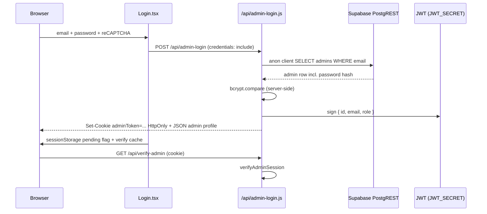

# 04 — Admin Auth Architecture

Documentation of how admin login and authorization work today (code review, read-only).

---

## Current admin login flow



---

## Login: frontend-direct or backend-mediated?

**Backend-mediated.**

| Step | Location |
|------|----------|
| Form submit | `src/pages/admin/Login.tsx` ~line 200+ — `fetch(API_ROUTES.ADMIN_LOGIN, { credentials: 'include' })` |
| Credential verification | `api/admin-login.js` lines 222–242 |
| Session issuance | `api/admin-login.js` lines 244–272 — HttpOnly cookie |

Frontend does **not** verify password locally.

---

## Does frontend query `admins` table directly?

**Not for login.** Login uses API only.

**However:** Admin dashboard and related UI query many sensitive tables directly via Supabase client — see `05-frontend-supabase-usage.md`. No direct `from('admins')` in `src/` grep results.

Backend login **does** query admins:

```223:229:api/admin-login.js
    const supabase = createClient(process.env.SUPABASE_URL, process.env.SUPABASE_ANON_KEY);

    const { data: admin, error: dbError } = await supabase
      .from('admins')
      .select('*')
      .eq('email', emailNorm)
      .single();
```

---

## bcrypt / password hash verification: client or server?

**Server-side only** for login.

| Location | Lines | Notes |
|----------|------:|-------|
| `api/admin-login.js` | 231–241 | `bcrypt.compare(password, admin.password)` |
| `src/pages/admin/Dashboard.tsx` | 239–240 | bcrypt used to **hash** new passwords when creating admins (client-side hash before API — investigate in hardening) |
| `api/admin-pos.js` | 179–180 | POS user password hashing (server) |
| `api/scan.js` | 190–192 | Scanner login bcrypt (server) |

**Client-side password hashing in Dashboard.tsx (line 239)** is a separate concern — password plaintext may still reach API; admin **read** of existing hashes is the RLS critical issue.

---

## Admin session storage mechanism

| Mechanism | Used? | Details |
|-----------|:-----:|---------|
| HttpOnly cookie | **Yes** | `adminToken` JWT, 5h (`Max-Age=18000`), `Secure` in production, `SameSite=Lax` — `api/admin-login.js` lines 259–272 |
| localStorage | **No** (admin) | Supabase client uses localStorage for **Supabase Auth** session (`src/integrations/supabase/client.ts` line 21) — separate from admin JWT |
| sessionStorage | **Partial** | `ADMIN_SESSION_PENDING_KEY` during login redirect — `src/lib/admin-verify-cache.ts`, `Login.tsx` line 320 |
| JWT | **Yes** | Custom JWT signed with `JWT_SECRET` |

Comment in `Login.tsx` line 295: *"No localStorage cleanup needed - session is managed by server token only"*

---

## Role / permission checks: server vs React only?

**Both — server is authoritative for API; React is UI-only.**

### Server-side (authoritative)

| Component | Path | Lines |
|-----------|------|------:|
| Session verification | `api/_lib/admin-authorization.mjs` | 40–193 |
| HTTP wrapper | `api/_lib/verify-admin-http.js` | 33+ |
| Re-export | `api/_lib/admin-verify.js` | 7–27 |
| Permission helpers | `shared/admin/permissions.mjs` | (imported) |
| Route guard usage | `api/misc.js` | 40+ handlers call `verifyAdminAuth` |
| POS admin routes | `api/admin-pos.js` | 749–751 |
| Presale admin | `api/_lib/presale-route-admin-codes.js` | 104–108 |
| Admin logs | `api/_lib/admin-logs-route.js` | 35–43 |

`verifyAdminSession` flow:

1. Parse `adminToken` from cookie (`admin-authorization.mjs` lines 18–21)
2. Verify JWT with `JWT_SECRET` (lines 63–80)
3. Load admin from DB with service role or anon key (lines 102–126)
4. Load `admin_tab_access` rows (lines 149–161)
5. Resolve permissions via `resolveAdminEffectiveAccess` (lines 163–166)

### Client-side (UI gating only)

| Component | Path | Purpose |
|-----------|------|---------|
| Protected route | `src/components/auth/ProtectedAdminRoute.tsx` | Calls `/api/verify-admin` |
| Verify cache | `src/lib/admin-verify-cache.ts` | Short-lived client cache of verify response |
| Tab visibility | Admin dashboard components | Uses allowedTabs from verify — **not a security boundary** |

**Gap:** Client can bypass UI and call Supabase REST directly with anon key regardless of admin cookie.

---

## Admin logout

`api/misc.js` `/api/admin-logout` (~line 1655) — clears cookie via `clear-admin-token-cookie.js`.

---

## Related auth systems (not admin)

| System | Entry | Session |
|--------|-------|---------|
| Ambassadors | `/api/ambassador-login` in `misc.js` ~1805 | Server-managed (see ambassador routes) |
| Scanners | `/api/scanner-login` in `scan.js` | Server session |
| POS users | `/api/pos/*` in `pos.js` | POS-specific |
| Academy influencer | `/api/academy-influencer/login` | misc.js |

---

## Configuration risks

| Issue | Location | Lines |
|-------|----------|------:|
| JWT fallback secret | `api/admin-login.js` | 245 — `'fallback-secret-dev-only'` |
| JWT fallback secret | `api/_lib/admin-authorization.mjs` | 33, 53–60 |
| Admin DB lookup via anon key | `admin-login.js`, `admin-authorization.mjs` | Works because RLS allows SELECT on admins |

---

## File path index

| Concern | File | Lines |
|---------|------|------:|
| Login UI | `src/pages/admin/Login.tsx` | 1–500 |
| Login API | `api/admin-login.js` | 1–293 |
| Session verify | `api/_lib/admin-authorization.mjs` | 1–196 |
| Protected route | `src/components/auth/ProtectedAdminRoute.tsx` | 1–100 |
| Supabase browser client | `src/integrations/supabase/client.ts` | 1–32 |
| API route map | `vercel.json` | 56–57, 236–241 |
